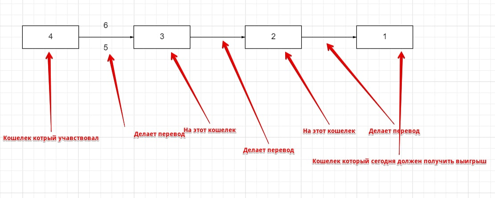

# RewardsTransactionCheck
Проверка BNB адресов участников конкурсов в проекте PandaGirl на повторное участие в конкурсе

Вводная.
В проекте [Panda Girl](https://t.me/PandaGirlToken) (токен экосистемы BNB [#PGIRL](https://coinmarketcap.com/currencies/panda-girl/)) проходят еженедельные конкурсы -шилинги.
Для участия в которых необходимо иметь определенное количество токенов на адресе кошелька.
Награды за участие выплачиваются каждый день. 
Учавствовать можно 1 раз в неделю.

Проблема.
Некотрые участники используют полученное вознаграждение для того что бы обойти правила конкурса в части минимального депозита на счете и еженедельного учстия.
Создавая дополнительные кошельки на которые отоправляются токены выигранные в конкурсе. И учавствуют повторно в течении одной неделе.
Делают это многократно с разных аккаунтов.

Решение. 
Данная программа оперирует двумя списками.
Тех кто уже получил выигрыш на этой неделе. И тех кто претендует на выигрышь сегодня.
Рекурсивно просматривая входящие транзакция на адресс участников ищет транзакции с кошельков которые уже принимали участие.
Плюс делает проверки на минимальный баланс. 

